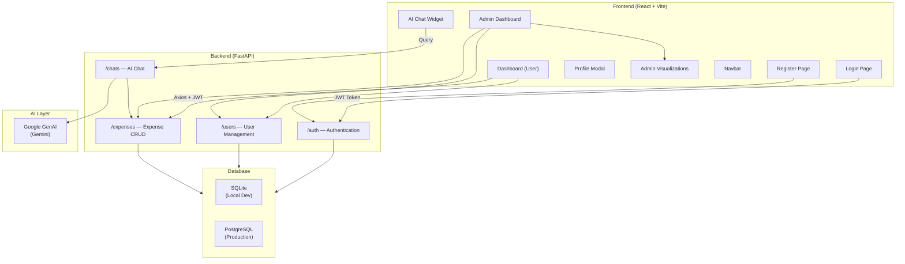

# 💰 Expense Tracker App

A full-stack personal finance application to log expenses, visualize spending habits, manage budgets, and get AI-powered insights — all with role-based access control for both regular users and admins.

---

## 🏗️ Architecture



---

## ✨ Features

### 👤 User Features
- **Expense Logging** — Add, edit, delete expenses with amount, category, date, and notes
- **Dashboard** — Visual overview of spending with charts (bar, pie, line) via Recharts
- **Category Filtering** — Filter and search expenses by category, date range, and amount
- **AI Chat Assistant** — Ask questions about your expenses in natural language (powered by Google Gemini)
- **Profile Management** — Update profile info and change password via modal

### 🛡️ Admin Features
- **User Management** — View all registered users, activate/deactivate accounts
- **Global Analytics** — Visualize expense data across all users with `AdminVisualizations`
- **Admin Dashboard** — Dedicated admin view with user and system-wide stats

### 🔐 Authentication & Security
- JWT-based authentication (`python-jose`)
- Password hashing with `passlib` + `bcrypt`
- Role-based access (admin vs. regular user)
- `create_admin.py` utility to bootstrap admin accounts

---

## 🛠️ Tech Stack

### Frontend
| Tool | Purpose |
|---|---|
| React 19 + Vite | UI framework and build tool |
| Tailwind CSS | Styling |
| React Router DOM v7 | Client-side routing |
| Axios | HTTP client for API calls |
| Recharts | Data visualization charts |
| Lucide React | Icon library |

### Backend
| Tool | Purpose |
|---|---|
| FastAPI | REST API framework |
| Uvicorn | ASGI server |
| SQLAlchemy | ORM for database interaction |
| Pydantic | Request/response data validation |
| python-jose | JWT token generation & validation |
| passlib + bcrypt | Password hashing |
| Google GenAI | AI-powered expense insights |
| python-dotenv | Environment variable management |
| psycopg2-binary | PostgreSQL adapter |

---

## 📁 Project Structure

```
expense-tracker-app/
├── backend/
│   ├── app/
│   │   ├── api/
│   │   │   └── endpoints/
│   │   │       ├── auth.py        # Login, token generation
│   │   │       ├── users.py       # User CRUD, profile
│   │   │       ├── expenses.py    # Expense CRUD
│   │   │       └── chats.py       # AI chat with Gemini
│   │   ├── core/                  # Config, security utilities
│   │   ├── crud/                  # Database query helpers
│   │   ├── db/                    # SQLAlchemy models & engine
│   │   ├── schemas/               # Pydantic schemas
│   │   └── main.py                # FastAPI app, router registration
│   ├── create_admin.py            # Admin account bootstrap script
│   ├── transfer_data.py           # Data migration utility
│   └── requirements.txt
├── frontend/
│   └── src/
│       ├── pages/
│       │   ├── Login.jsx
│       │   ├── Register.jsx
│       │   ├── Dashboard.jsx       # Main user view
│       │   └── AdminDashboard.jsx  # Admin-only view
│       ├── components/
│       │   ├── ChatWidget.jsx      # Floating AI chat UI
│       │   ├── AdminVisualizations.jsx
│       │   ├── Navbar.jsx
│       │   └── ProfileModal.jsx
│       ├── context/                # React context (Auth, etc.)
│       └── App.jsx                 # Routes definition
└── README.md
```

---

## 🚀 Getting Started

### Prerequisites
- [Node.js](https://nodejs.org/) v16+
- [Python](https://www.python.org/) v3.8+

### Backend

```bash
cd backend
python -m venv venv
# Windows
venv\Scripts\activate
# macOS/Linux
source venv/bin/activate

pip install -r requirements.txt
```

Create a `.env` file in `backend/`:
```env
SECRET_KEY=your_jwt_secret_key
GOOGLE_API_KEY=your_google_genai_key
DATABASE_URL=sqlite:///./expenses.db   # or postgresql://...
```

Run the server:
```bash
uvicorn app.main:app --reload
```

- API: `http://localhost:8000`
- Swagger UI: `http://localhost:8000/docs`

### Frontend

```bash
cd frontend
npm install
npm run dev
```

- App: `http://localhost:5173`

### Create Admin Account

```bash
cd backend
python create_admin.py
```

---

## 🔑 API Endpoints Overview

| Tag | Prefix | Description |
|---|---|---|
| Authentication | `/` | Login, register, token refresh |
| Users | `/users` | Profile, password change, admin user management |
| Expenses | `/expenses` | Create, read, update, delete expenses |
| Chats | `/chats` | AI-powered expense Q&A via Google Gemini |

Full interactive documentation: `http://localhost:8000/docs`

---

## 📄 License

MIT License — see [LICENSE](LICENSE)